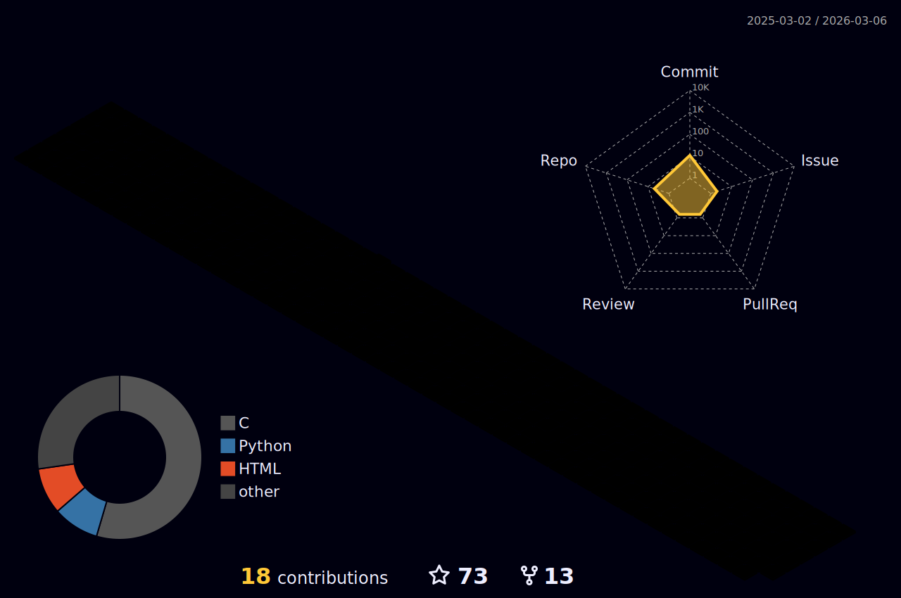

<h1 align="center">Hi , I'm Guglielmo Cerri</h1>
<h3 align="center">A passionate and curious data scientist and bioinformatician from Italy 🇮🇹</h3>

 

<em>Snake game from my Github contributions graph</em>

 
 

 
<em> My Github profile trophy </em>

 
  
 

- 🔭 I’m currently working on **Data Science and Bioinformatics**.
- 🌱 I’m currently learning **PyTorch**.
- 🤝 I'm looking to collaborate on **Artificial Intelligence** projects.
- 💬 Ask me about Anything! I am happy to help.
- ⚡  Fun fact: what's the last one?: The Z.
- 📫 How to reach me **cerriguglielmo@gmail.com**.
 

<h2 align="left"> 🔗 &nbsp;Connect with me</h2>

&nbsp;

<h2> 🚀 &nbsp;Some Tools I Have Used and Learned </h2>

<code>  </code>
<code>  </code> 
<code>  </code>
<code>  </code> 
<code>  </code>
<code>  </code>
<code>  </code>
<code>  </code>
<code>  </code>

<code>  </code>
<code>  </code>
<code>  </code>
<code>  </code> 
<code>  </code>
<code>  </code>
<code>  </code> 
<code>  </code> 
<code>  </code>

<code>  </code>
<code>  </code> 
<code>  </code> 
<code>  </code>
<code>  </code>
<code>  </code> 
<code>  </code>
<code>  </code>
<code>  </code>

<code>  </code>
<code>  </code>
<code>  </code> 
<code>  </code>
<code>  </code>
<code>  </code>
<code>  </code>
<code>  </code>
<code>  </code>

 

<h2>📈 &nbsp;Some stats </h2>

<kbd>
 
</kbd>

 

  
 
<h2 align="left">✊ &nbsp;Support</h2>

 

